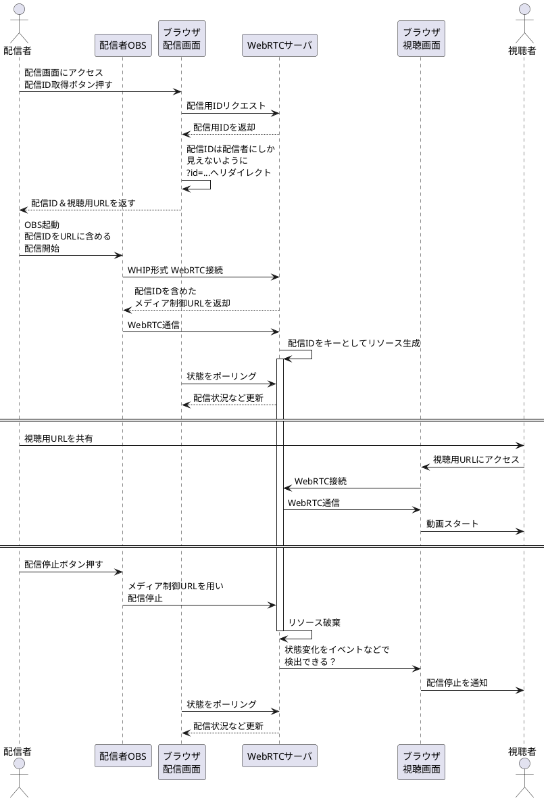
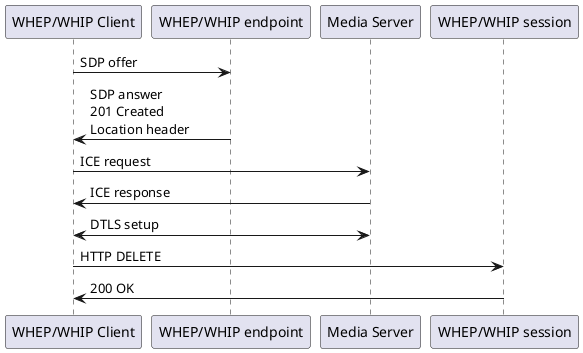
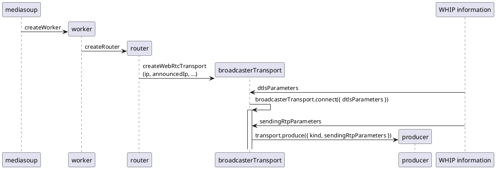

# mediasoup による WebRTC Server/Client 作成
珍しく ChartGPT がそのまま動くようなプログラムを生成できないので
色々検討+メモ

## 複数の配信管理の方法検討

### 2024-10-15

#### 接続・ID検討
routerを2つ用意しておいて、空いている方を使う
使用中かどうか判断するには、undefinedを代入するか...

router使用状況は専用ページから見られるようにしておく

consumerは6-8個まで作れるようにし、
超えた分は古い順にサーバ側・クライアント側ともに順番に破棄する

意図しないクライアントに視聴されることは一応防ぎたいので、
（ホラー系の動画など？）クライアントは接続時にIDを必要とする

IDをどうやって通知するか...
配信者は専用の画面を使って操作できるようにするべきか
毎回はいらないかもだがOBSの設定画面スクショなども出しておきたいし...

- 配信停止処理を行わなければ配信用IDは有効なままなので、
  一時的な通信の問題などで接続が切れても再接続できる
  - OBSは深刻なエラーの際には自動で配信停止処理を行う？
- 仮に配信停止ボタンを押しても配信用IDを有効なままに出来れば、
  すぐに再配信したいときも対応できそう

配信用URL
`GET https://b60.faveo-systema.net/broadcast`

WHIP接続用URL
`POST https://b60.faveo-systema.net/broadcast?id=...`

視聴用URL
`GET https://b60.faveo-systema.net/stream?id=...`

### 2024-10-14
最初に動作確認を行ったバージョンは配信者1, 視聴者1 の状況にしか
対応していないので、これを実用的なレベルにしたい。

視聴側はクライアントアプリを開くと新しいconsumerを作ればよいだろうか？
古いconsumerから順番に削除するか...

https://mediasoup.org/documentation/v3/scalability/

には

> A Router holds producers and consumers that exchange 
> audio/video RTP between them. In certain common usages, 
> a router can be understood as a “multi-party conference room”.

とあるので、server側のtransportを大量生成する必要は無いのだろう

では、必要なくなったserver側のconsumerをどうやって削除するのだろうか？

→ https://mediasoup.org/documentation/v3/mediasoup/garbage-collection/ に記述がありました

- 必要なリソースはプログラム中で参照を保持し、
  gabage collectされないようにしておく
- 関連するリソース(worker, router, transport, producer, consumer)は、
  上位のものがcloseされると自動的にcloseされる
- 逆に言えば、自前できちんと生成・削除を管理する必要がある
  - ~~ということは、不要になったtransportをcloseしてしまえば
    関連するproducers/consumersはまとめてcloseできる~~
  - routerを削除した方が速そう、"room の様なもの"であるという記述も
    どこかにあったし...
    サンプルプログラムもそうなっていた気がする

## mediasoup を使うために覚えておきたい概念
https://leaysgur.github.io/posts/2020/03/24/152051/
に色々記述が有る、ありがたい

- Worker
- Router
- Transport
- Producer
- Consumer

という概念が（少なくともサーバ側だけでも）ある。

## mediasoupを使ったコードをいじり倒した上でドキュメントを再確認
結構ちゃんと書いてある、用語などピンとこなかったのであれだが、
もし最初に読んだときに理解できるならこれ以上のものはないかも

### 勘違いしていそうなポイント
~~外部のRTP通信でproducerを作るときには、PlainTransportらしい~~

素のRTP接続の時はPlainTransportとなる、WebRTC接続はICEやDTLS等も含む
より複雑なものになるらしい、だから色々種類があるのか...

https://mediasoup.org/documentation/v3/communication-between-client-and-server/

clientでconsumeするには、
- device.rtpParameters をサーバに送信
- そのパラメータを使ってrouter.canConsumeで確認
- Okならtransport.consumeする
- client側のtransport.connectで必要な処理を行う

## WHIP/WHEPとmediasoup{,-client}間の通信について
RFCより(https://datatracker.ietf.org/doc/html/draft-ietf-wish-whip)
### WHIP/WHEP

## mediasoup/ WHIP(OBS)/WHEP?(client)

## Client-Serverの連携について
ある程度のネゴシエーション？というより情報のやりとり？は
必要になりそう。

https://github.com/NNNiNiNNN/mediasoup-socketio-test

では websocket メッセージのやりとりで、

https://github.com/versatica/mediasoup-demo

では POST API 等を用いて、
「これからクライアントが接続するから、consumeする」とか、
準備が行われているようだ。
その際に色々情報を（transport関連のオプション設定等）受け渡している

例えばクライアントが接続してくる際に consumer をサーバ側で用意するのは
なんとなくわかるとして、クライアント側の処理に必要な情報をサーバが何か
渡していたりしないだろうか？

transport 関連の parameters を渡しているみたい。
server と同じ構成のtranpsortをクライアント側でも作っている。

→ mediasoupドキュメントに色々書いてある

https://mediasoup.org/documentation/v3/communication-between-client-and-server/

